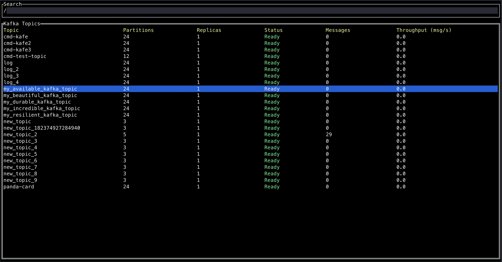
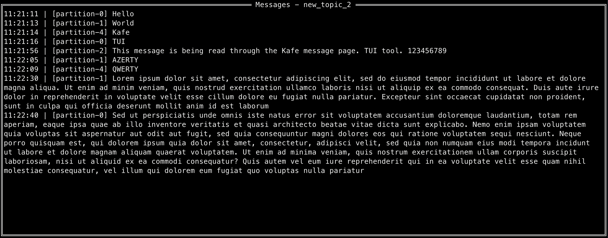
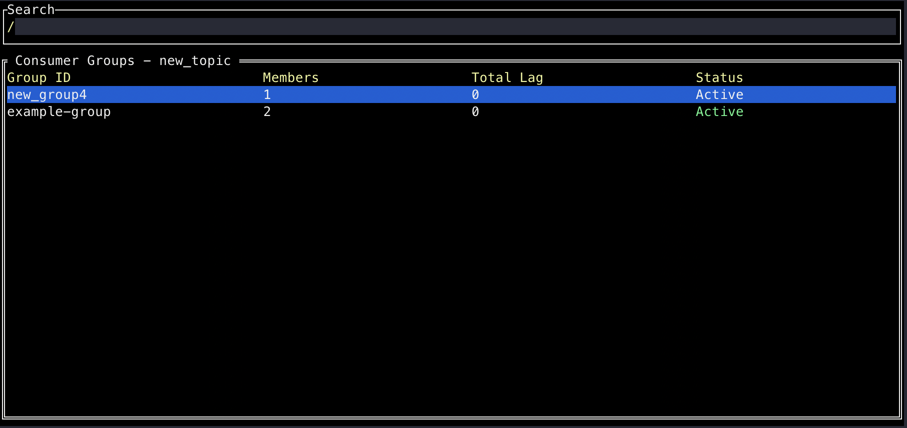

# Kafe

Kafe is a TUI tool which helps observe and manage Kafka clusters.

## Features

Topics listing:

Peaking at messages:

Consumer groups listing:

## Development

- [ ] Cluster's topics listing
  - [x] Table view of the cluster's topics
  - [x] Search by topic name
  - [ ] Viewing partition details
  - [ ] Leader/follower status
- [ ] Topic management
- [ ] Message inspection
  - [x] Peak at messages in the topic
  - [ ] Filter
- [ ] Consumer group monitoring
  - [x] List consumer groups
  - [x] Track offsets
  - [ ] Partitions assignment
  - [ ] Uneven partition assignment or lag
- [ ] Broker health
  - [ ] Monitor brokers health
  - [ ] Performances
  - [ ] Partition reassignment infos
- [ ] Performances metrics
  - [ ] Throughput
  - [ ] Lag
  - [ ] Error rate
- [ ] Interactive query
  - [ ] Query topic
  - [ ] Query offset

## TODO

- [ ] Effective information fetching (fetch topics constantly, but information only of displayed topics)

## Ideas

- As constantly pulling all the infomation from the cluster might be expensive both for the client and the cluster, we can think of only pulling the topics information on startup. The informations for a given topic could also be fetched for the currently hovered topic. But also a watch list could be implemented to keep track of the topics we are interested in (e.g Shift + W to add currently hovered topic to watch list).

- Some standards warnings could be raised for certain topics for irrational behaviors (maybe let's do this in another tab). For example:
  - A topic with a single partition (which is a dangerous configuration)
  - Consumer group that is lagging only on a subset of partitions

## Details

The statuses are:

- "Ready" - This indicates a healthy topic where:
  - All partitions have an active leader
  - All partitions have their expected in-sync replicas (ISR)
- "Warning" - This status appears when:
  - The topic has a leader for its partitions
  - But there are issues with the in-sync replicas (ISR) - either they're missing or there's an error accessing them
- "Error" - This is the most severe status, occurring when:
  - There's no leader for one or more partitions
  - Or there's an error trying to get the leader information
